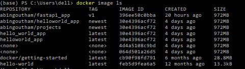
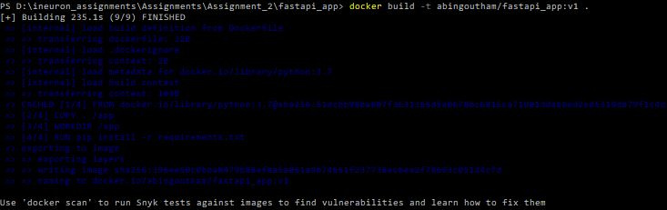
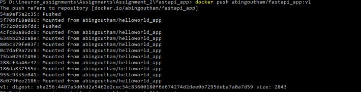
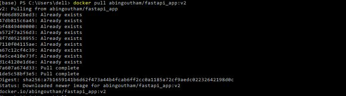
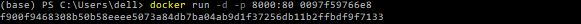
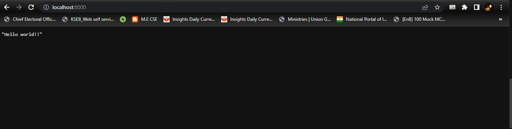
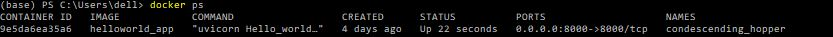
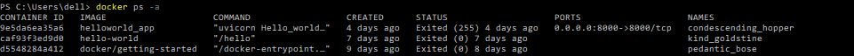
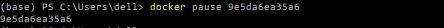
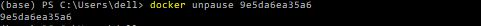

#### Some basic commands in Docker.

##### 1. docker image ls

###### To display all the docker images present locally.

##### 2. docker build -t image-name : tag .

###### To build a new docker image locally.

##### 3. docker tag image-name:existing-tag image-name(existing or new):new-tag
  
###### To change the existing tag of the given image.
  

  
  
  
##### 4. docker login

###### To login to the Docker Hub account from the terminal.

.JPG)

##### 5. docker push user-name/image-name : tag

###### To push the image to a repository in Docker Hub

##### 6. docker pull user-name/image-name : tag

###### To pull a docker image from Docker Hub

##### 7. docker run -d -p  host_port:container_port  image-name or image-id

###### To create a container as well as start it.

###### On running the above example on localhost:8000, we get

##### 8. docker ps

###### To get a list of all containers that are currently running

##### 9. docker ps -a

###### To get a list of all available containers

##### 10. docker pause  container-name or container-id

###### To pause the given container

##### 10. docker unpause  container-name or container-id

###### To resume the given container

